# -Pr-ctica-de-laboratorio-02-Servlets-JSP-y-JPA
Practica de lab JPA

Index plublico donde se pueden presentar los diferentes productos de las empresas seleccionadas, estas pueden ser vistas sin necesiad de un inicio de sesion

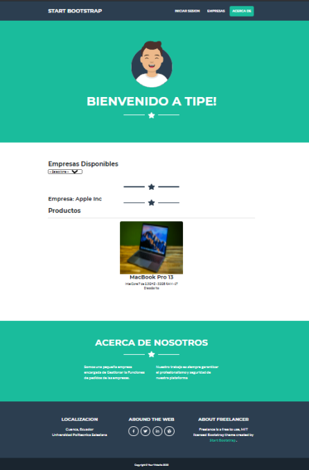

/public/IniciarSesion.html

Esta pagina publica se encuentran dos campos para ingresar a la sesion, siendo estos el email y la contraseña

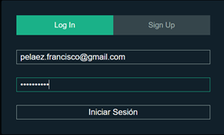

/private/admin_index.jsp

Es el servelt de Iniciar Sesion en donde podemos ver que Utilizamos MD5 para ela encriptacion de la contraseña, esto nos ayuda a tener una mayor seguridad

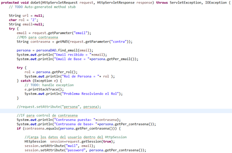
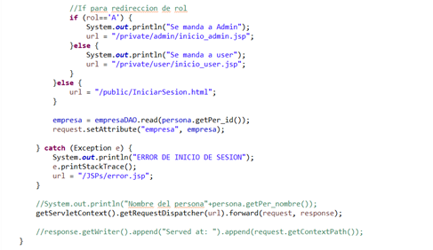

Pagina de inicio de Administrador

Agregar Productos por parte del administrador

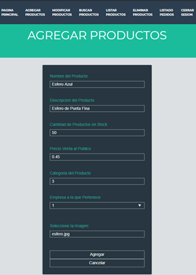

En el siguiente servlet podemos ver como agregamos los productos.

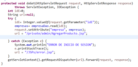

Pra hacer las redirecciones dentro del proyecto, hemos tomado la descicion de mandar a todo lado el objeto empresa, para asi tener una mayor conectividad

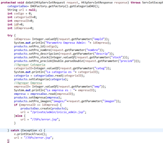

Eliminacion de Productos por parte del Administrador

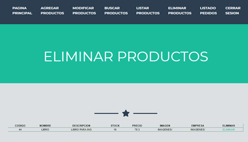

Pagina de interfaz par listar los productos por parte del administrador

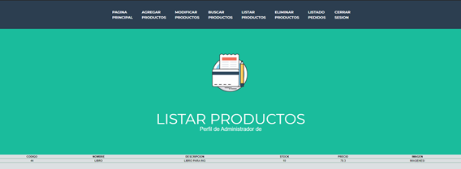

Servlet que sirve para enllistar todos los productos de la misma empresa

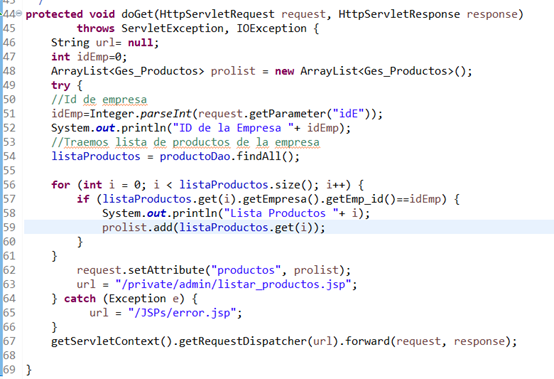

Pagina para listar Pedidos

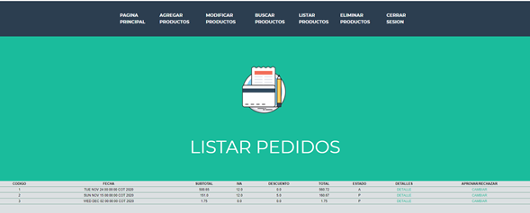

Pagina para hacer pedidos, con esto se hacen las compras de los productos de su empresa

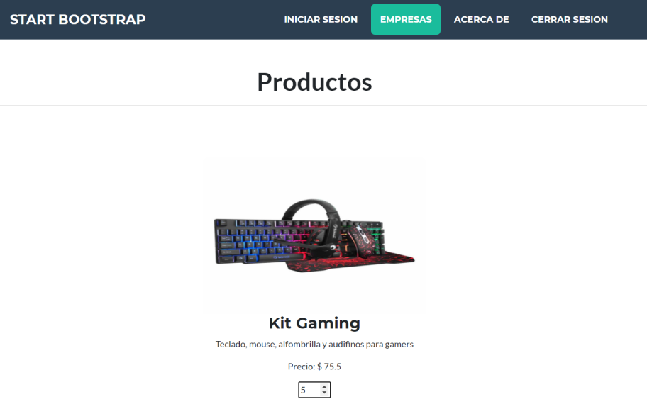

Factura por parte del sistema despues de hacer una compra de uno o varios productos de una empresa.
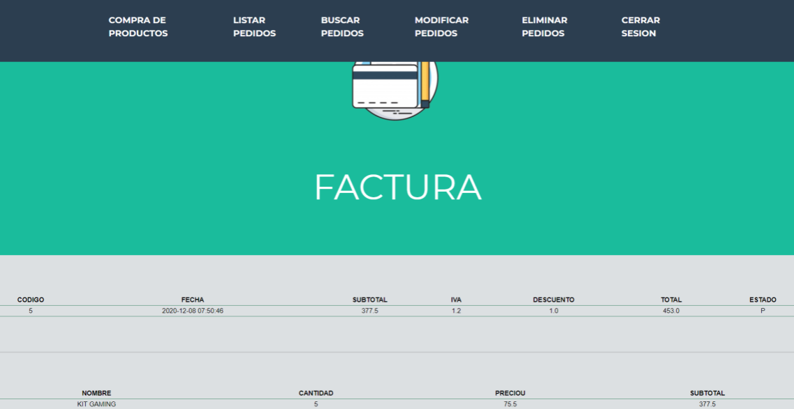
